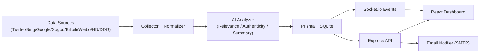

# BottleFind

<p align="center">
  <b>AI-Native Hotspot Intelligence Platform</b><br/>
  Multi-source trend monitoring, relevance scoring, and real-time alerting for AI/Tech teams.
</p>

<p align="center">
  <a href="https://github.com/Duang777/bottlefind-app/stargazers"></a>
  <a href="https://github.com/Duang777/bottlefind-app/network/members"></a>
  <a href="https://github.com/Duang777/bottlefind-app/issues"></a>
  
  
  
</p>

## Table Of Contents

- [Why BottleFind](#why-bottlefind)
- [Core Features](#core-features)
- [Tech Stack](#tech-stack)
- [Architecture](#architecture)
- [Project Structure](#project-structure)
- [Quick Start](#quick-start)
- [Environment Variables](#environment-variables)
- [Dev Commands](#dev-commands)
- [API Surface](#api-surface)
- [Roadmap](#roadmap)
- [Contributing](#contributing)
- [Security](#security)
- [License](#license)

## Why BottleFind

BottleFind is built for teams that need to detect high-value signals early:

- Product teams tracking market and model trends
- Content/ops teams collecting credible updates quickly
- AI engineering teams watching framework/model ecosystem changes

Compared with manual monitoring, BottleFind delivers:

- Continuous multi-source collection
- AI-powered relevance and authenticity screening
- Real-time push + searchable dashboard

## Core Features

- Keyword lifecycle management: create, pause/resume, delete
- Multi-source ingestion: Twitter, Bing, Google, DuckDuckGo, HackerNews, Sogou, Bilibili, Weibo
- AI analysis pipeline: summary, relevance score, importance tier, authenticity indicator
- Interactive dashboard: sorting, filtering, pagination, trend cards
- Manual trigger + scheduled jobs for hotspot scans
- Real-time notifications: WebSocket stream + optional SMTP email
- Standalone skill package: `skills/bottlefind-radar` for script-based trend workflows

## Tech Stack

| Layer | Stack | Notes |
|---|---|---|
| Frontend | React 19, TypeScript, Vite 7, Tailwind CSS v4, Framer Motion | Ollama-inspired grayscale UI system |
| Backend | Node.js, Express 5, Socket.io | REST + WebSocket hybrid service |
| Data | Prisma ORM, SQLite | Lightweight local persistence |
| AI | OpenRouter SDK | Relevance and credibility analysis |
| Scheduler | node-cron | Periodic hotspot scan jobs |
| Testing | Vitest | Server-side unit tests |
| Tooling | ESLint, TypeScript | Linting and type-safety |

## Architecture



## Project Structure

```text
bottlefind-app/
|-- client/                        # React dashboard
|   |-- src/
|   |   |-- components/            # UI and filter components
|   |   |-- services/              # API / socket clients
|   |   |-- utils/                 # sorting/time helpers
|   |   `-- App.tsx                # main app shell
|   `-- package.json
|-- server/                        # Express + scheduler + analysis pipeline
|   |-- src/
|   |   |-- routes/                # REST API routes
|   |   |-- services/              # source integrations + AI services
|   |   |-- jobs/                  # cron jobs
|   |   `-- __tests__/             # unit tests
|   |-- prisma/                    # schema and migrations
|   `-- package.json
|-- skills/
|   `-- bottlefind-radar/          # reusable trend discovery skill package
`-- docs/                          # setup and integration docs
```

## Quick Start

### 1. Clone

```bash
git clone https://github.com/Duang777/bottlefind-app.git
cd bottlefind-app
```

### 2. Setup Server

```bash
cd server
npm install
npx prisma generate
npx prisma db push
```

### 3. Setup Client

```bash
cd ../client
npm install
```

### 4. Configure Environment

```bash
copy ..\server\.env.example ..\server\.env
```

### 5. Run

Open two terminals:

```bash
# terminal A
cd server
npm run dev

# terminal B
cd client
npm run dev
```

- Frontend: `http://localhost:5173`
- Backend: `http://localhost:3001`

## Environment Variables

`server/.env`:

| Key | Required | Description |
|---|---|---|
| `DATABASE_URL` | No | Defaults to local SQLite |
| `PORT` | No | Server port, default `3001` |
| `CLIENT_URL` | No | Frontend origin for CORS/WebSocket |
| `OPENROUTER_API_KEY` | Yes | AI analysis key |
| `TWITTER_API_KEY` | Optional | Twitter source ingestion |
| `SMTP_HOST` | Optional | SMTP host for email notifications |
| `SMTP_PORT` | Optional | SMTP port |
| `SMTP_SECURE` | Optional | SSL/TLS switch |
| `SMTP_USER` | Optional | SMTP username |
| `SMTP_PASS` | Optional | SMTP password / app token |
| `NOTIFY_EMAIL` | Optional | Receiver address |

## Dev Commands

### Server

```bash
cd server
npm run dev
npm run build
npm run test
npm run db:generate
npm run db:push
npm run db:studio
```

### Client

```bash
cd client
npm run dev
npm run build
npm run preview
```

## API Surface

Main routes:

- `GET /api/health`
- `GET/POST/PUT/PATCH/DELETE /api/keywords`
- `GET /api/hotspots`
- `POST /api/hotspots/search`
- `GET /api/hotspots/stats`
- `GET/PATCH/DELETE /api/notifications`
- `PUT /api/settings`
- `POST /api/check-hotspots`

WebSocket:

- `subscribe` / `unsubscribe`
- `hotspot:new`
- `notification`

## Roadmap

- [ ] Fine-grained RBAC and multi-user workspace mode
- [ ] Pluggable source adapters (Reddit, YouTube, RSS)
- [ ] Prompt/version control for AI analysis policy
- [ ] Daily/weekly digest generation pipeline
- [ ] Docker one-command deployment

## Contributing

Contributions are welcome.

1. Fork repository
2. Create branch: `feat/xxx` or `fix/xxx`
3. Commit with clear message
4. Open Pull Request with validation notes (`build`, `test`)

Recommended checks before PR:

```bash
cd server && npm run test && npm run build
cd ../client && npm run build
```

## Security

- Never commit `.env` or secrets
- Rotate API keys if exposed
- For vulnerability checks, run `npm audit` in both `client` and `server`

If you find a security issue, open a private channel first instead of a public issue.

## License

No explicit `LICENSE` file is committed yet.
If this repository will be distributed as a public open-source project, add a license (for example MIT/Apache-2.0) as the next step.
